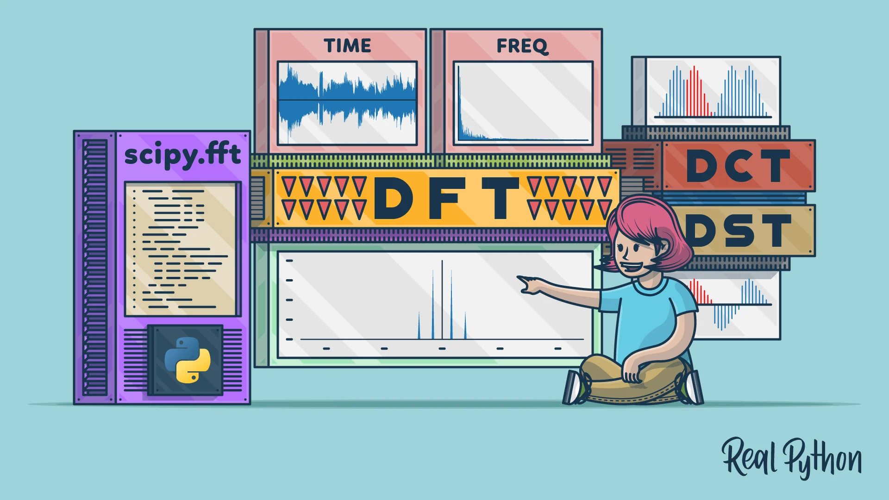

# Time Series with Python

In this repository I will start a series, based on Data Camp ['Time Series with Python'](https://app.datacamp.com/learn/skill-tracks/time-series-with-python) course. I will reproduce the content seen in the course using Python and drawing conclusions from the data.

  

   

**Background in:** Mathematics, Python, Machine Learning and Applied Math.

**Links:**
* [LinkedIn](https://www.linkedin.com/in/joão-pedro-lavor-65162312b/)
* [Medium](https://jplavorr.medium.com/)

Time series data is one of the most common data types and understanding how to work with it is a critical data science skill if you want to make predictions and report on trends. In this track, you'll learn how to manipulate time series data using pandas, work with statistical libraries including NumPy and statsmodels to analyze data, and develop your visualization skills using Matplotlib, SciPy, and seaborn. You'll then apply your time series skills using real-world data, including financial stock data, UFO sightings, CO2 levels in Maui, monthly candy production in the US, and heartbeat sounds. By the end of this track, you'll know how to forecast the future using ARIMA class models and generate predictions and insights using machine learning models.

## Projetos:

---

